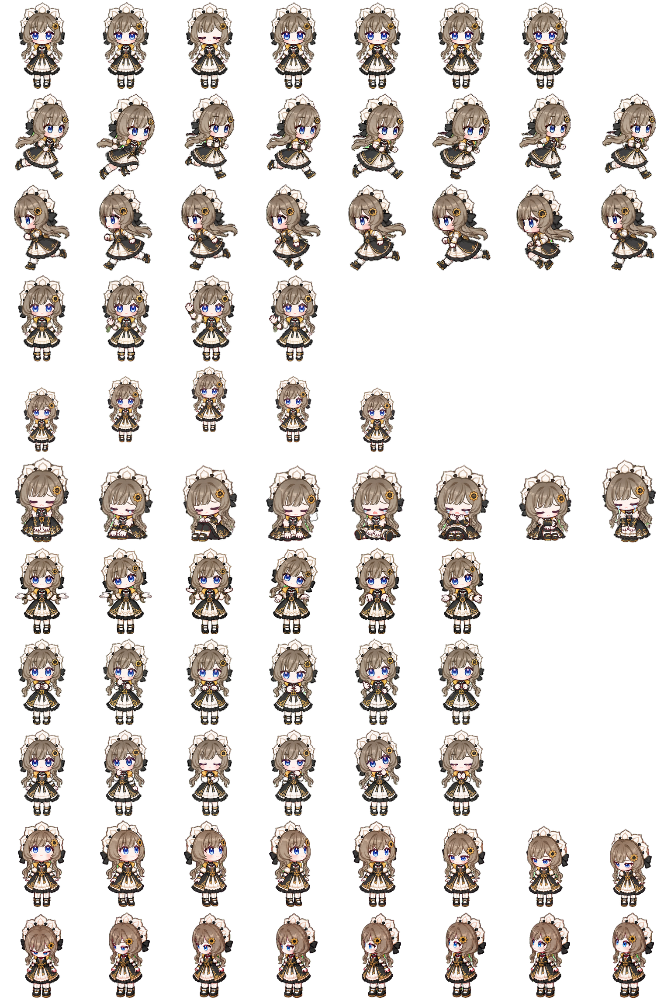

# Sandrone Codex Pet

Codex 桌面宠物资源包：元数据 + WebP 精灵图，`spriteVersionNumber: 2`。

## 内容与安装

- `pet.json`：ID、显示名、描述和资源路径。
- `spritesheet.webp`：实际使用的精灵图。
- 在 Windows 上将本目录复制到 `%USERPROFILE%\.codex\pets\sandrone`，重启应用后在宠物选择器中选择 Sandrone。当前机器上的已安装资源来自此目录；不同应用版本的加载行为需实机确认。

## 贡献边界

这是宠物素材与配置作品，适合展示角色视觉落地和应用资源打包，不等同于开发了 Codex 宠物引擎。图像生成过程、逐帧制作方式及底层生成模型未在本次整理中核验。

角色相关名称及第三方权益属于相应权利人；此仓库不声明获得官方授权，也不对第三方角色元素授予再许可。
